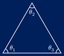
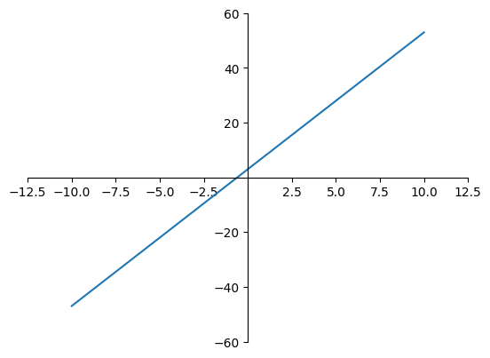
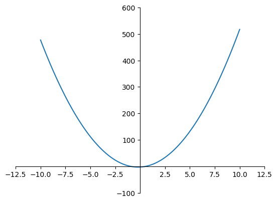

## Vad är programmering?
- Författandet av _algortimer_,
- och implementerandet av dessa algoritmer m.h.a. ett programmeringsspråk så att datorn kan utföra dem.

::: {.text-center}

Att förstå algoritmer är mycket viktigare än att förstå programmeringsspråk!

:::

# Att författa algoritmer

> **algoritm**, algoritmen, algoritmer (subst.)
>
> _instruktionsföljd för lösning av problem av (mer el. mindre) matematiskt slag_
>
> --- Svenska Akademiens Ordlista (2026)

## Ett inledande exempel

::: {.columns}

::: {.column}

{width=80%}

:::

::: {.column}

$$
\begin{align*}
\theta_1 + \theta_2 + \theta_3 &= 180^\circ\\
\theta_3 &= 180^\circ - \theta_1 - \theta_2
\end{align*}
$$

Vår algoritm är då

1. Subtrahera $\theta_1$ från $180^\circ$,
2. subtrahera $\theta_2$ från resultatet, och
3. det du har kvar är $\theta_3$.

:::

:::


::: {.notes}

- Vi börjar med en algoritm för att hitta tredje vinkeln i en triangel.
- En algoritm som nämnt, är alltså ett _arbetssätt_

:::

## Motsvarande i kod

```python
steg1 = 180 - theta1
steg2 = steg1 - theta2
return steg2
```

## Motsvarande i kod
Eller lite mer kompakt...
```python
return 180 - theta1 - theta2
```

## Större exempel


{width=95%}
Hälsningsalgoritmen

# Hur algoritmer blir till kod

## Kompilering


## Tolkning


# Funktioner

## Funktionsbegreppet

Vad är en funktion?

- En funktion är lite som en mekanisk låda:
    1. Något går in
    2. Det behandlas
    3. Och något kanske går ut

## Matematiska funktioner

Ett matematiskt uttryck som tar _argument_ och ger ett _funktionsvärde_.


::: {.columns}

::: {.column .centered}


En graf av $f(x) = 5x + 3$


{}

:::

::: {.column .centered}

En graf av $f(x) = 5x^2 - 2x + 3$



:::

:::


## Funktioner som kod


```{python code-line-numbers="1-2|4-5"}
#| echo: true
def mattefunktion(x):
    return 5 * x + 3

def andragradsfunktion(x):
    return 5 * x**2 + 2 * x - 3
```


::: {.fragment }


::: {.h-5}


:::

```{python}
print("mattefunktion(5)")
print(f">>> {mattefunktion(5)}")
print()
print("andragradsfunktion(3)")
print(f">>> {andragradsfunktion(3)}")
```

:::

## Funktioner med flera indata


```python
def addition(a, b):
    return a + b

def sätt_ihop(del1, del2):
    return "del1: " + del1 + " och del 2: " + del2
```

## Variablers synlighet


::: {.columns}

::: {.column}

::: {.nonincremental}

```python {code-line-numbers="|2-5"}
def funktion(a, b):
    tal1 = a - 3       # <1>
    tal2 = b * 3

    return tal1 - tal2 # <2>
```


1. Start av block
2. Slut av block

:::


:::

::: {.column}

- Variabler existerar endast inom _blocket_
- Saker definierade för hela programmet kallas _globala_
- Variabler i blocket tar prioritet över globala variabler
- Lokala variabler raderas efter att blocket tar slut

:::

:::

## Funktioner som algoritmer

En funktion kan...

- ...ha ingen indata, eller ingen direkt utdata
- ...exekvera --- köra --- mer än bara beräkningar


::: {.fragment}

Ett exempel:


```python
def skriv_namn(namn):
    print("Hej! Jag heter: " + namn)
    print("Kul att träffas :)")
```


:::
